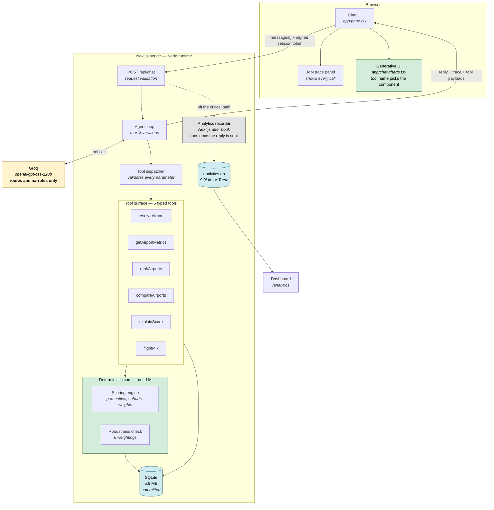
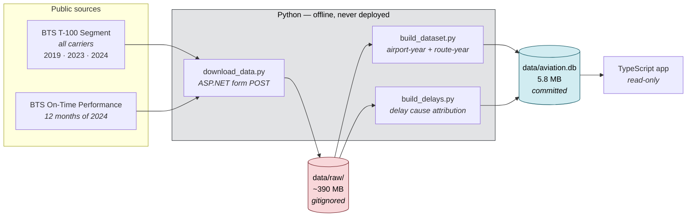
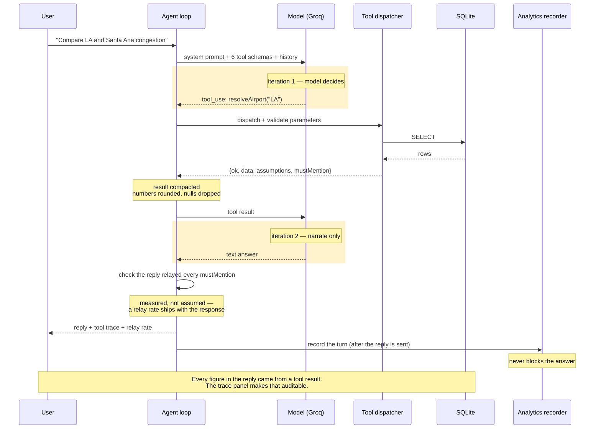
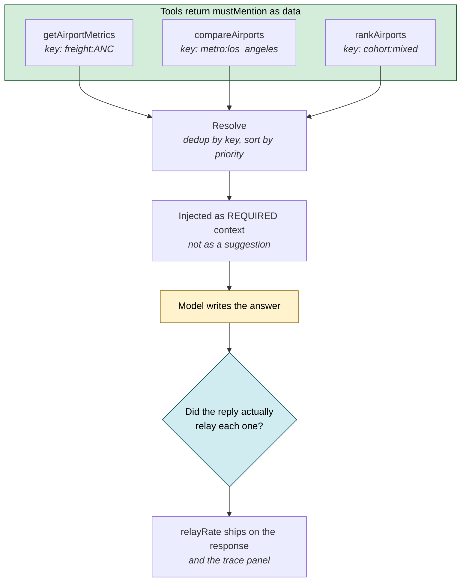
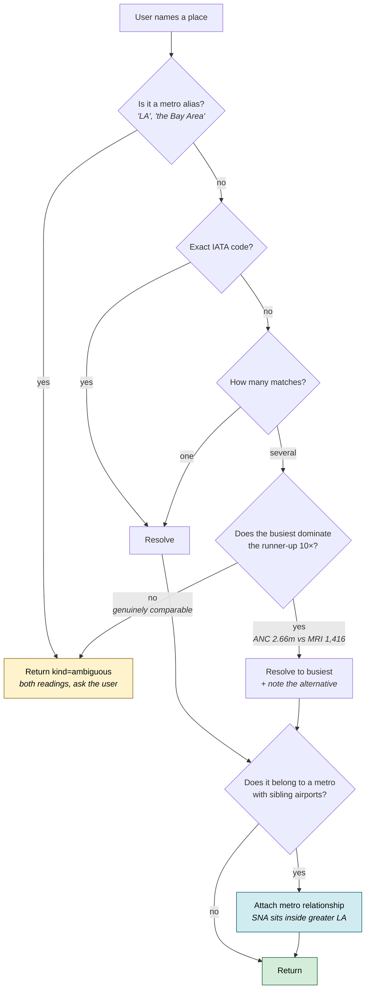
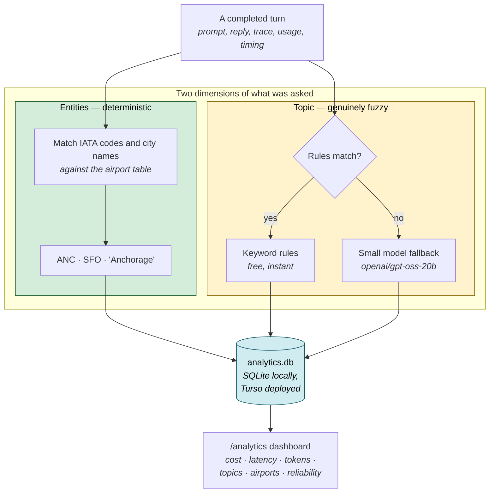
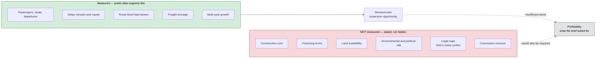

# Architecture Diagrams

Companion to [`../DESIGN.md`](../DESIGN.md). Every diagram here renders natively on GitHub.

---

## 1. System overview

The central claim of this design: **the language model computes nothing.** It selects a tool,
passes parameters, and narrates what comes back. Every number in every answer originates below the
tool boundary.

**Reading the colours:** green is deterministic and unit-tested; amber is the only
non-deterministic component; blue is data at rest. Notice that no arrow runs from the amber box
into the green one — the model cannot reach the calculation.

The same holds for the charts. The model selects a tool; the tool's typed result travels to the
browser; the tool's NAME selects a component, which renders that result verbatim. Which figures
appear in an answer is generated per turn — what they say is not. No arrow runs from the amber box
to the charts either.

**The recorder hangs off a dashed arrow on purpose.** It runs after the reply has already been
sent, so measurement cannot slow down or fail an answer — the worst case for a broken analytics
write is a missing row, never a failed question. Diagram 7 covers what it records.

---

## 2. Offline data pipeline

Runs once on a developer machine. ~390 MB of raw government files become a 5.8 MB database that is
committed to the repository and deployed with the app. The application never parses a CSV.

**Why pre-ingest rather than query live:** T-100 is published with a multi-month lag, so
per-request freshness buys nothing real while adding latency and a live failure mode. A demo that
dies on a rate limit is worse than a documented snapshot.

---

## 3. How a score is computed

Four components, each converted to a percentile **within the airport's size cohort**, then combined
as a weighted sum. The percentile step is what makes incompatible units — percent, minutes,
percentage points — addable at all.

Figures shown are San Francisco's actual 2024 values. Read the *components*, not the total: SFO is
the most delay-constrained large hub in the country (98.4th percentile) while shrinking (11.3th) —
a profile the single number 57.3 completely hides.

---

## 4. The agent loop

Structurally a workflow with one agentic segment. The model chooses which tools to call and in what
order; the tool set is fixed, every parameter is validated, and the loop is bounded. Constrained
systems are predictable, and for an investment tool predictability beats autonomy.

---

## 5. Required context — asking, then checking

The brief asks the agent to communicate assumption, uncertainty and scoping. A prompt that *asks*
for caveats gets them filtered: told that caveats were "worth including where they matter", the
model dropped Anchorage's freight note — 5.75 billion pounds of cargo against 2.66 million
passengers, which is the single most important thing about reading that airport's passenger
figures.

So context that an answer is wrong without travels as a **field on the tool result**, and the reply
is checked against it afterwards.

**Two decisions worth defending.**

*The fact is attached to the airport, not to one tool.* The first version emitted the metro
relationship only from `compareAirports` — then the model answered "compare LA and Santa Ana" with
`resolveAirport` plus two `getAirportMetrics` calls, never touched `compareAirports`, and compared
the two airports without ever saying they share a catchment area. Every tool that returns an
airport now emits it, and the `key` collapses the duplicates.

*Asking without checking is still only persuasion.* `checkRelayed` looks for each item's distinctive
signals — figures, airport codes — in the finished reply, and the relay rate is returned with the
answer. That turns a hope about prompt-following into a number that would show up in the analytics
if it regressed.

---

## 6. Ambiguity handling

The brief's "compare LA and Santa Ana" question is deliberately ambiguous twice over: *LA* could
mean one airport or five, **and Santa Ana is itself inside greater Los Angeles.** The system
surfaces that rather than silently picking one.

**The design rule:** ask when the answer depends on the user's *intent*; don't ask when one option
is obviously right. Making a user choose between Anchorage International and a general-aviation
field with 1,416 passengers is not care, it is obtuseness.

---

## 7. Conversation analytics

Recording what was asked, what it cost, how long it took, and what it was *about*. All of it runs
after the reply has been sent, so the measurement can never delay or fail the thing it measures.

**The same green/amber boundary as everywhere else in this system.** Recognising that "Anchorage"
and "ANC" mean the same airport is a lookup against a table the app already has — there is no
reason for a language model to decide whether ANC is an airport, and a deterministic answer is free,
instant and cannot drift. Topic is the genuinely ambiguous part, so it gets rules first and a small
model only when the rules abstain. The classifier is deliberately *not* the model that answers
questions: it is cheaper, and it keeps six months of topic history from shifting when the chat model
is swapped.

**Why the session id is signed.** `turn_id` is derived from it and the write is an upsert, so
accepting any well-formed id from the browser would let a caller name — and therefore overwrite —
another conversation's recorded turn. The server mints a signed token and ignores anything it did
not sign. Validation degrades rather than rejects: an unrecognised token earns a fresh session
instead of failing the request, because refusing to answer a question over a bad telemetry label
would invert the priority between the product and the measurement of it.

---

## 8. Where the boundary sits

What the system measures, and what it deliberately does not.

The brief asks which airports make renovation most *profitable*. Public aviation data cannot answer
that. It can rigorously answer the demand side, and naming the gap is part of the deliverable
rather than an admission against it.
