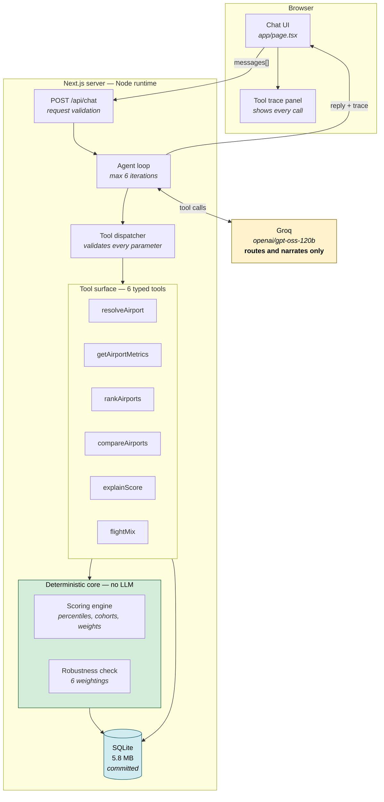
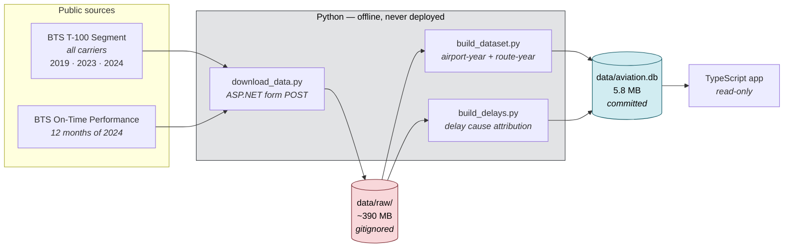
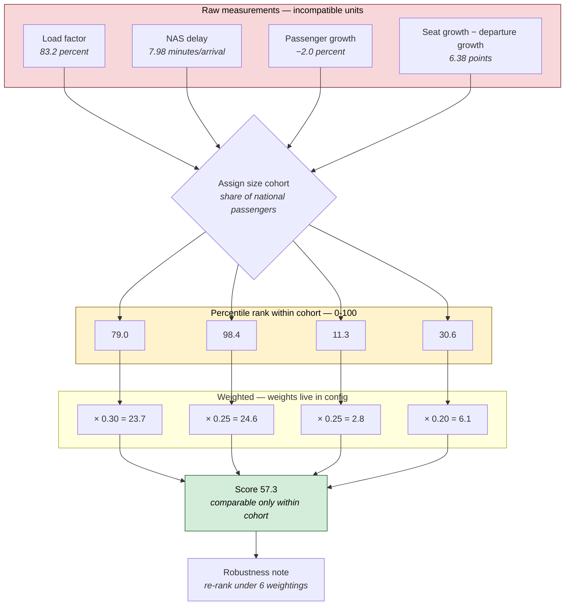
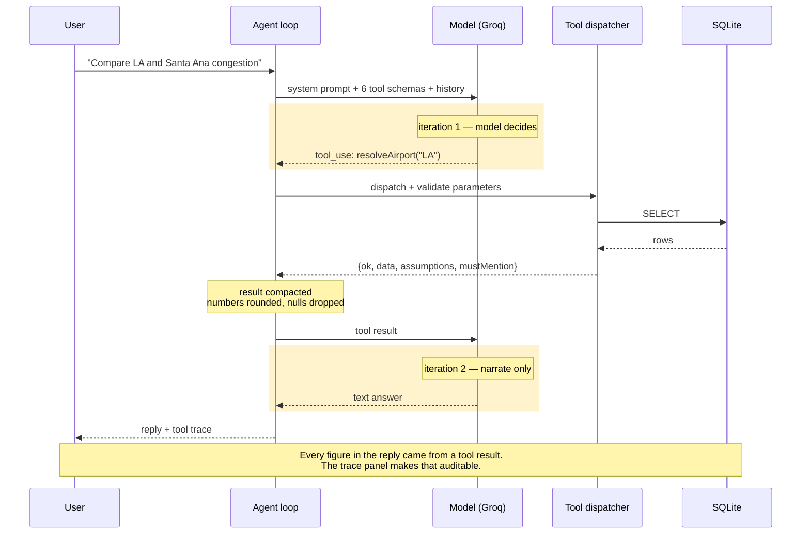
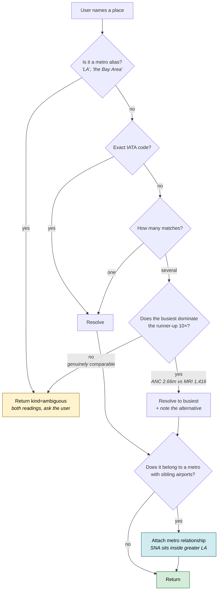
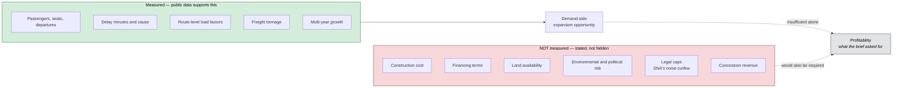

# Architecture Diagrams

Companion to [`../DESIGN.md`](../DESIGN.md). Every diagram here renders natively on GitHub.

---

## 1. System overview

The central claim of this design: **the language model computes nothing.** It selects a tool,
passes parameters, and narrates what comes back. Every number in every answer originates below the
tool boundary.

**Reading the colours:** green is deterministic and unit-tested; amber is the only
non-deterministic component; blue is data at rest. Notice that no arrow runs from the amber box
into the green one — the model cannot reach the calculation.

---

## 2. Offline data pipeline

Runs once on a developer machine. ~390 MB of raw government files become a 5.8 MB database that is
committed to the repository and deployed with the app. The application never parses a CSV.

**Why pre-ingest rather than query live:** T-100 is published with a multi-month lag, so
per-request freshness buys nothing real while adding latency and a live failure mode. A demo that
dies on a rate limit is worse than a documented snapshot.

---

## 3. How a score is computed

Four components, each converted to a percentile **within the airport's size cohort**, then combined
as a weighted sum. The percentile step is what makes incompatible units — percent, minutes,
percentage points — addable at all.

Figures shown are San Francisco's actual 2024 values. Read the *components*, not the total: SFO is
the most delay-constrained large hub in the country (98.4th percentile) while shrinking (11.3th) —
a profile the single number 57.3 completely hides.

---

## 4. The agent loop

Structurally a workflow with one agentic segment. The model chooses which tools to call and in what
order; the tool set is fixed, every parameter is validated, and the loop is bounded. Constrained
systems are predictable, and for an investment tool predictability beats autonomy.

---

## 5. Ambiguity handling

The brief's "compare LA and Santa Ana" question is deliberately ambiguous twice over: *LA* could
mean one airport or five, **and Santa Ana is itself inside greater Los Angeles.** The system
surfaces that rather than silently picking one.

**The design rule:** ask when the answer depends on the user's *intent*; don't ask when one option
is obviously right. Making a user choose between Anchorage International and a general-aviation
field with 1,416 passengers is not care, it is obtuseness.

---

## 6. Where the boundary sits

What the system measures, and what it deliberately does not.

The brief asks which airports make renovation most *profitable*. Public aviation data cannot answer
that. It can rigorously answer the demand side, and naming the gap is part of the deliverable
rather than an admission against it.
